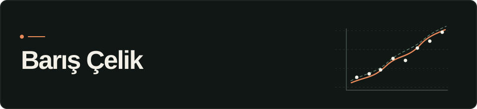

  

I'm **Barış**, a third-year Computer Engineering student at **Yıldız Technical University**.

[Portfolio](https://personal-website-eta-drab-26.vercel.app) · [LinkedIn](https://linkedin.com/in/baris-celik) · [Repositories](https://github.com/bariscelikk1?tab=repositories)

## Projects

### cALorie

A workout video analyzer that finds exercise segments, counts repetitions and estimates calorie ranges.

I started this project because I wanted to learn what I could do with pose landmarks and simple movement rules. It grew into a full-stack project with a Python worker, an API and a web interface.

[Live app](https://c-a-lorie.vercel.app) · [Source](https://github.com/bariscelikk1/cALorie) · [How it works](https://github.com/bariscelikk1/cALorie/blob/main/docs/how-calorie-works.md)

### DermAI

One of my machine learning projects. I trained a seven-class skin lesion classifier with EfficientNetB0 and the HAM10000 dataset.

This project taught me a lot about class imbalance, data leakage and building a repeatable training pipeline. It is a student research project, not a diagnostic tool.

[Demo](https://dermai-steel.vercel.app) · [Source](https://github.com/bariscelikk1/dermai)

### Mihenk

An open-source project we are preparing for the Zemin360 Hackathon.

The idea is to match institutions with young talent using project evidence, statistical scoring and team optimization. It is still at an early stage.

[Project repository](https://github.com/bariscelikk1/mihenk)

## Tools

I mostly use Python and TypeScript. Recently, I've been working with Next.js, FastAPI, TensorFlow and PostgreSQL.
