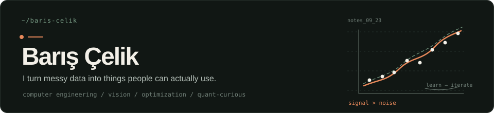

  

I'm **Nurullah Barış Çelik**, a Computer Engineering student at **Yıldız Technical University**. My projects combine computer vision with web applications: processing images and video, building the API, and making the results understandable.

[Portfolio ↗](https://personal-website-eta-drab-26.vercel.app) &nbsp; / &nbsp; [Browse my code](https://github.com/bariscelikk1?tab=repositories)

## Two projects to start with

### 01 &nbsp; cALorie
**A workout video, broken down into movements.**

A web application for mixed-workout analysis: exercise segments, repetition counts, timed holds and estimated energy expenditure.

The interesting part is handling uncertainty. MediaPipe supplies body landmarks; movement rules identify supported exercises. Rest and unrecognized periods stay separate instead of being forced into an exercise label. Calorie outputs are estimates, not measurements.

Python · OpenCV · MediaPipe · FastAPI · Next.js · Supabase

[Try the app](https://c-a-lorie.vercel.app) &nbsp; · &nbsp; [Code](https://github.com/bariscelikk1/cALorie) &nbsp; · &nbsp; [How it works](https://github.com/bariscelikk1/cALorie/blob/main/docs/how-calorie-works.md) &nbsp; · &nbsp; [Tests](https://github.com/bariscelikk1/cALorie/tree/main/worker/tests)

### 02 &nbsp; DermAI
**Image classification, with attention to the data.**

A seven-class dermoscopic image classifier using EfficientNetB0 transfer learning on HAM10000.

The training pipeline splits data by lesion rather than individual image to reduce leakage between training and validation. It also handles class imbalance and separates classifier-head training from fine-tuning. This is a research prototype, not a diagnostic tool.

Python · TensorFlow / Keras · EfficientNetB0 · Transfer learning

[Try the demo](https://dermai-steel.vercel.app) &nbsp; · &nbsp; [Code](https://github.com/bariscelikk1/dermai) &nbsp; · &nbsp; [Data pipeline](https://github.com/bariscelikk1/dermai/blob/main/src/dermai/data.py)

## Tools behind the work

**Models & data** — Python, TensorFlow / Keras, OpenCV, MediaPipe  
**Applications** — TypeScript, React, Next.js, FastAPI  
**Storage & deployment** — PostgreSQL, Supabase, Vercel

---

These are student projects. The repositories document their implementation and limitations.
